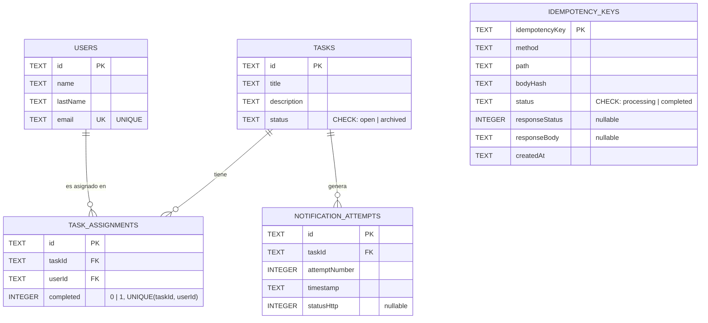

# Diagrama UML — Base de datos TaskNotification

Diagrama entidad-relación correspondiente a [`sql/schema.sql`](../sql/schema.sql).

> El diagrama completo, con estereotipos UML (`<<PK>>`, `<<FK>>`, `<<UK>>`), multiplicidades y notas de diseño, está en formato **PlantUML** editable en [`docs/database-uml.puml`](./database-uml.puml) — abrilo en [PlantText](https://www.planttext.com/), la extensión de VS Code, draw.io o cualquier herramienta compatible con PlantUML. El diagrama de abajo (Mermaid) es una vista rápida que se renderiza directo en GitHub.

## Notas de las relaciones

- **`USERS` ↔ `TASKS`** es N:M, resuelta por la tabla puente **`TASK_ASSIGNMENTS`**. El `UNIQUE(taskId, userId)` en esa tabla es lo que garantiza a nivel de base de datos que un usuario no puede asignarse dos veces a la misma tarea (no solo se valida en el código de negocio).
- **`TASKS` → `NOTIFICATION_ATTEMPTS`** es 1:N — cada tarea puede tener hasta 3 intentos de notificación registrados (según la política de reintentos).
- **`IDEMPOTENCY_KEYS`** es una tabla independiente, sin FK hacia el resto del esquema — solo correlaciona claves de idempotencia con la respuesta HTTP que generaron, sin importar a qué recurso de negocio pertenecía ese request.
- Todos los IDs son `TEXT` (UUID v4 generados en la capa de aplicación), no `INTEGER AUTOINCREMENT` — ver justificación en el README, sección "Supuestos ante ambigüedades".